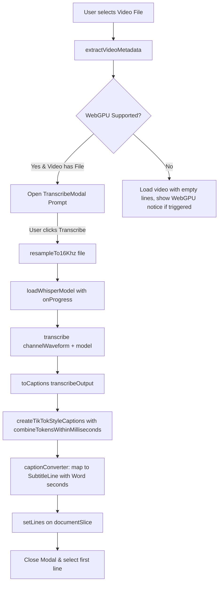

# In-Browser Auto-Transcription Design Specification

## 1. Overview & Goals

Captionly needs an effortless way for creators to transcribe speech directly from imported videos into timed subtitle cues without relying on cloud services, API keys, or backend servers.

This feature enables **100% in-browser auto-transcription** using WebGPU and Whisper models via `@remotion/whisper-webgpu` and `@remotion/captions`. When a user selects a video file, the system offers an immediate 1-click transcription prompt, downloads and caches the model locally, resamples the audio via Web Audio APIs, and populates the document with word-synchronized subtitles.

### Key Principles (Ponytail Senior-Dev Mode)
- **Zero Backend / Zero API Keys**: All inference and audio processing happens client-side in the browser.
- **YAGNI & Zero Undo Bloat**: Auto-transcribe populates initial lines directly on the document without polluting the undo/redo stack.
- **Minimal Dependencies**: Leverage `@remotion/whisper-webgpu` and `@remotion/captions`—thin, official Remotion wrappers around `Transformers.js` and Web Audio that handle 16kHz resampling, token alignment, and TikTok-style line paging without writing custom Web Audio boilerplate.
- **Reliable Fallback**: Gracefully detect WebGPU availability and inform unsupported browsers without crashing or freezing.

---

## 2. Architecture & Module Structure

The feature lives primarily inside `@captionly/studio`:

```
apps/studio/src/
├── transcribe/
│   ├── types.ts                    # Model options, pacing presets, pipeline state
│   ├── transcribeService.ts        # Pure pipeline: WebGPU check, resample, load model, transcribe
│   ├── captionConverter.ts         # Maps @remotion/captions TikTokPage to SubtitleLine[]
│   ├── TranscribeModal.tsx         # Dialog with model select, pacing select, progress indicators
│   └── __tests__/
│       └── captionConverter.test.ts # Unit tests for caption to SubtitleLine mapping
├── app/
│   └── PlayerRail.tsx              # Hooked to prompt modal on video load
└── lines/
    └── LinesPanel.tsx              # "Auto-Transcribe" manual button in header/empty state
```

### Dependencies
- `@remotion/whisper-webgpu`: `4.0.521` (matches project Remotion version)
- `@remotion/captions`: `4.0.521` (matches project Remotion version)

---

## 3. Data Flow & Pipeline



### 1. Audio Resampling
`resampleTo16Khz({ file: File })` decodes the audio track using the browser's Web Audio API (`AudioContext.decodeAudioData`), downmixes to mono, and resamples to a 16,000 Hz `Float32Array`.

### 2. Model Loading & Caching
`loadWhisperModel({ model, onProgress })` downloads the ONNX weights from Hugging Face if not already cached. Browser IndexedDB/Cache storage keeps the weights persistent across sessions.
Supported options:
- `base.en` (Default, ~73MB): Fast download, high accuracy for English.
- `tiny.en` (Fastest, ~39MB): Lowest memory footprint, instantaneous on fast connections.
- `small.en` (High Precision, ~244MB): Best for difficult audio or heavier accents.

### 3. Whisper WebGPU Inference
`transcribe({ channelWaveform, model })` passes the waveform buffer to the WebGPU compute shader pipeline and returns timestamped words.

### 4. Caption Page Segmentation & Type Mapping
Whisper's raw output is converted via `@remotion/captions`:
- `toCaptions({ whisperWebGpuOutput })` generates standard `Caption[]` (`startMs`, `endMs`, `text`).
- `createTikTokStyleCaptions({ captions, combineTokensWithinMilliseconds })` partitions the tokens into display groups based on user pacing:
  - **Short / Reels style**: `combineTokensWithinMilliseconds: 1400` (~1.4s per line).
  - **Standard / YouTube style**: `combineTokensWithinMilliseconds: 3500` (~3.5s per line).
- `captionConverter` maps each `TikTokPage` to Captionly's `SubtitleLine`:
  - `id`: `crypto.randomUUID()`
  - `start`: `page.startMs / 1000` (seconds)
  - `end`: `(page.startMs + page.durationMs) / 1000` (seconds)
  - `words`: Array of `Word` objects with `{ id, text: token.text.trim(), start: token.fromMs / 1000, end: token.toMs / 1000 }`.

### 5. Document State Application
The generated `SubtitleLine[]` are directly set on the store:
```ts
set({
  lines: newLines,
  selectedLineId: newLines[0]?.id ?? null,
  editingLineId: null,
});
```
*(No undo entry is recorded, matching user requirement).*

---

## 4. UI / UX Specification

### `TranscribeModal`
- **Trigger**:
  1. Triggered automatically upon video selection/drop in `PlayerRail.tsx`.
  2. Triggered manually by clicking the "Auto-Transcribe" button in the Lines panel.
- **Elements**:
  - **Title & Description**: "Auto-Transcribe Video" — "Generate synchronized subtitles in your browser using local AI."
  - **Model Selector**:
    - `Base (Recommended - ~73MB)`
    - `Tiny (Fastest - ~39MB)`
    - `Small (High Precision - ~244MB)`
  - **Pacing Selector**:
    - `Short phrases (Reels / Shorts / TikTok)`
    - `Standard lines (YouTube / Long-form)`
  - **Status & Progress Area** (when active):
    - Progress bar displaying download % during model load.
    - Spinner with status text ("Extracting audio track...", "Downloading Whisper model (45%)...", "Transcribing speech...").
  - **Buttons**:
    - "Skip" (secondary, closes modal)
    - "Transcribe" (primary, starts pipeline)

---

## 5. Error Handling & Edge Cases

| Scenario | Behavior |
| :--- | :--- |
| **Browser lacks WebGPU** | Detect via `canUseWhisperWebGpu()`. Display clear banner in modal: *"In-browser AI transcription requires WebGPU. Please use Google Chrome, Microsoft Edge, or a WebGPU-compatible browser."* |
| **No audio stream in video** | Audio extraction fails; caught gracefully, showing toast: *"No audio track detected in this video."* |
| **Zero speech detected** | Whisper returns empty words array; leaves lines empty and shows toast: *"No speech detected in audio."* |
| **Network failure during download** | Show error message in modal with a *"Retry"* button. |
| **Demo video loaded** | If user clicks "Load demo video", sample subtitles are loaded as before without prompting transcribe. |

---

## 6. Testing Strategy

1. **Unit Tests (`bun test`)**:
   - `captionConverter.test.ts`:
     - Verify mapping from Remotion `TikTokPage` to Captionly `SubtitleLine`.
     - Verify conversion from milliseconds to seconds.
     - Verify trimmed words and non-empty IDs.
     - Verify handling of empty captions or empty pages.
2. **Integration Verification**:
   - Run `bun run dev:frontend` and test with real media.
   - Verify model download progress bar moves smoothly.
   - Verify captions populate the studio player, line editor, and export preview without errors.
